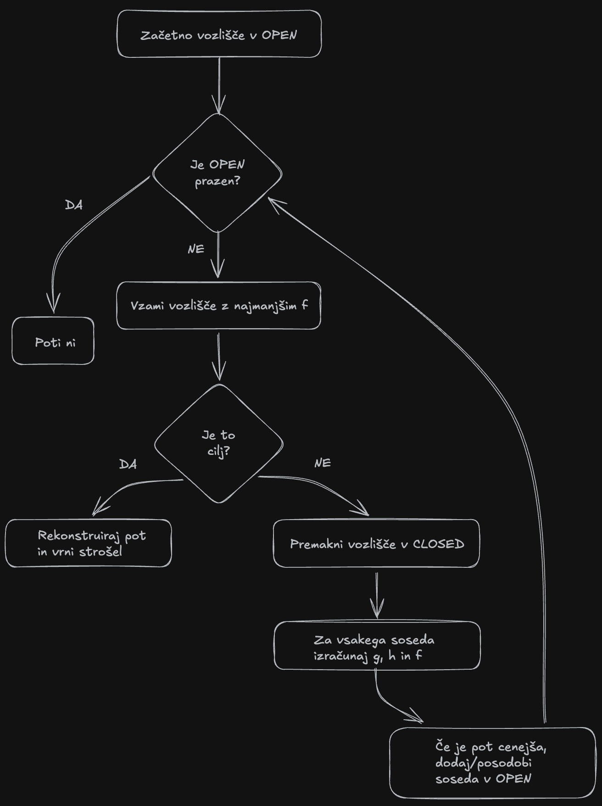
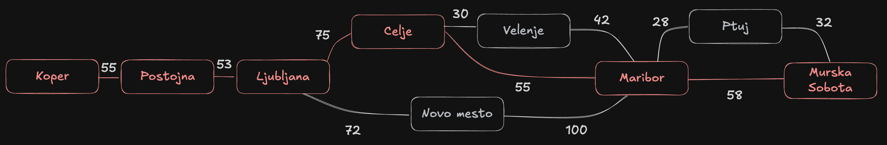

# Iskanje z algoritmom A*

Cilj naloge je razumeti in uporabiti algoritem A* (A-star) za iskanje najcenejše poti.

## Kako deluje A*

A* išče najcenejšo pot skozi graf. Vsakemu vozlišču pripiše tri števila:

- **g** = cena že prehojene poti od starta do tega vozlišča,
- **h** = hevristika, ocena, koliko je od tu še do cilja,
- **f = g + h** = ocena celotne poti, ki gre skozi to vozlišče.

V vsakem koraku A* iz seznama **OPEN** (vozlišča, ki čakajo) vzame vozlišče z **najmanjšim f**, ga premakne v **CLOSED** (obdelana vozlišča) in pogleda njegove sosede. Ker f združuje že prehojeno pot in oceno preostanka, se iskanje usmerja proti cilju in mu ni treba pregledati celega grafa.



### Primer

Majhno cestno omrežje med slovenskimi mesti (isto kot v `a_zvezda.py`), **start Koper, cilj Murska Sobota**. Povezave s ceno v km:

```
Koper-Postojna 55        Celje-Velenje 30         Maribor-Ptuj 28
Postojna-Ljubljana 53    Celje-Maribor 55         Maribor-Murska Sobota 58
Ljubljana-Celje 75       Novo mesto-Maribor 100   Ptuj-Murska Sobota 32
Ljubljana-Novo mesto 72  Velenje-Maribor 42
```

Hevristika h (ocena zračne razdalje do Murske Sobote, v km):

```
Koper 250   Postojna 210   Ljubljana 160   Celje 95   Novo mesto 135
Velenje 85  Maribor 50     Ptuj 28         Murska Sobota 0
```

Graf in najdena optimalna pot (rdeča vozlišča):



Prvi koraki na tem primeru:

1. V OPEN je samo **Koper** (f = 0 + 250 = 250). Vzamemo ga, sosed **Postojna** dobi g = 55, f = 55 + 210 = **265**.
2. Na vrsti je **Postojna** (265). Sosed **Ljubljana**: g = 108, f = 108 + 160 = **268**.
3. Na vrsti je **Ljubljana** (268). Soseda **Celje** (f = 278) in **Novo mesto** (f = 315).

Tako A* nadaljuje, dokler iz OPEN ne potegne cilja. Končna pot je **Koper, Postojna, Ljubljana, Celje, Maribor in Murska Sobota**, skupaj **296 km**. Celoten potek po korakih je v vzorčnem poročilu.

## Kaj se študent nauči

- Razume razliko med slepim in informiranim iskanjem ter vlogo hevristike.
- Razume pomen vrednosti g(n), h(n) in f(n).
- Razume vlogo seznamov OPEN in CLOSED ter kako določata vrstni red širjenja vozlišč.
- Razume, kako algoritem sestavi končno pot in njen strošek.
- Razume, zakaj dopustna hevristika zagotavlja optimalno pot.

## Naloga

Implementiraj A* in ga uporabi na problemu, ki si ga izbereš sam. Uporaben je povsod, kjer iščeš najcenejšo pot in imaš hevristiko do cilja. Nekaj primerov:

- pot na cestnem ali mestnem zemljevidu,
- pot v mreži (grid) za igro ali robota, s Manhattansko ali evklidsko razdaljo kot hevristiko,
- premične uganke, na primer osmica (8-puzzle), s številom napačno postavljenih ploščic kot hevristiko,
- katerikoli graf, kjer znaš definirati stroške povezav in hevristiko.

Sam definiraj vozlišča, povezave s stroški, začetno in ciljno stanje ter hevristiko h(n). Hevristika nikoli ne sme preceniti dejanske cene do cilja (dopustnost), sicer A* ne zagotavlja optimalne rešitve.

## Zahteve

1. Z A* poišči najcenejšo pot od začetnega do ciljnega stanja.
2. Za vsak korak prikaži razširjeno vozlišče ter g(n), h(n) in f(n).
3. Vodi seznama OPEN in CLOSED ter določi vrstni red širjenja.
4. Rekonstruiraj končno pot in izračunaj skupni strošek.
5. Oceni optimalnost (je hevristika dopustna in konsistentna?).
6. Implementiraj A* v Pythonu (priporočeno: `heapq` za OPEN, slovarji za graf in hevristiko). Koda naj izpiše potek in ga vizualizira.
7. Oddaj poročilo v PDF, 3-4 strani z grafi in razlago.

## Primer v tem repozitoriju

Vzorčno poročilo reši zgornji primer in prikaže celoten potek po korakih.

- `a_zvezda.py` - celotna rešitev (podatki, algoritem, izris). Za drug problem spremeniš podatke na vrhu datoteke.
- `algoritem_a_zvezda.pdf` - vzorčno poročilo.
- `slika1_graf.png`, `slika2_f.png` - grafa, ki ju ustvari koda.

## Zagon

```bash
python -m venv venv
source venv/bin/activate        # Windows: venv\Scripts\activate
pip install networkx matplotlib
python a_zvezda.py
```

Program izpiše vrstni red širjenja, optimalno pot in strošek ter shrani sliki `slika1_graf.png` in `slika2_f.png`.
